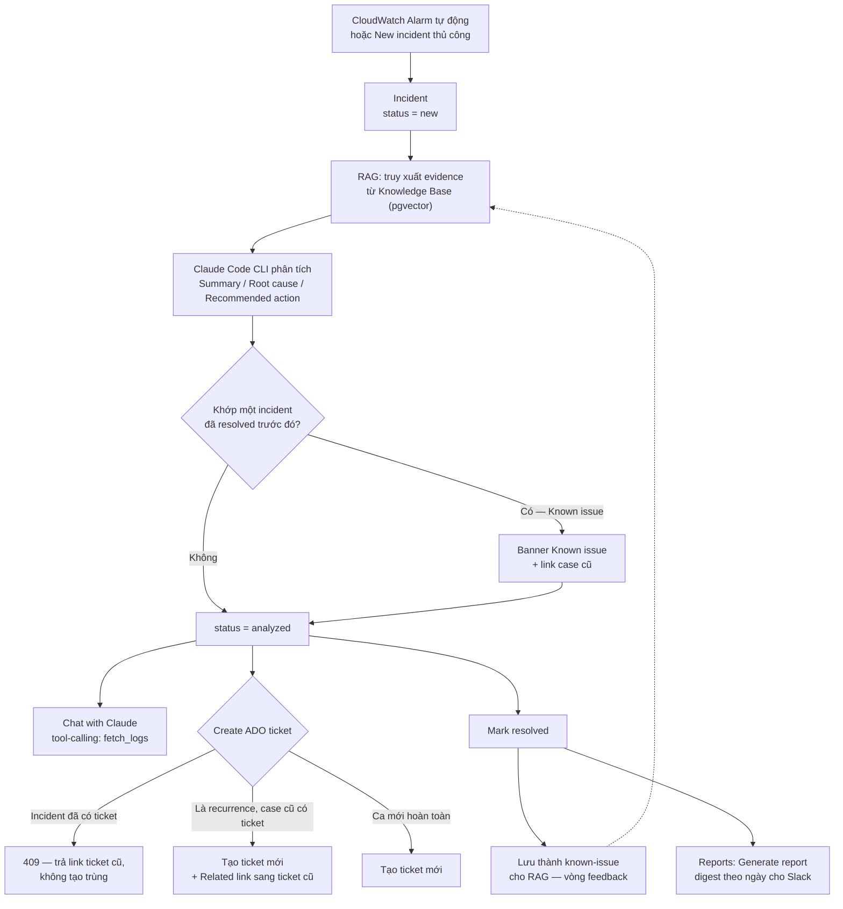

# IIM — Hướng dẫn setup & demo trên máy khác

Repo này chạy toàn bộ stack bằng Docker Compose (Postgres + pgvector, backend FastAPI, frontend
React). Hướng dẫn này dùng **`claude_cli`** làm LLM provider (Claude Code subscription cá nhân,
không tốn phí API riêng) — đúng như bản đang chạy demo hôm nay. Nếu máy demo không có Claude Code
subscription, xem mục 7 để đổi sang provider khác.

Thời gian setup lần đầu: ~15 phút (chủ yếu chờ `docker compose up --build` và đăng nhập Claude Code).

---

## 0. Sơ đồ luồng xử lý

Toàn bộ vòng đời một incident, đúng thứ tự sẽ trình diễn ở mục 8:



> Nói khi trình diễn: "Đây là một vòng lặp khép kín — mỗi ca được resolve sẽ tự động trở thành
> bằng chứng cho lần phân tích tiếp theo, không cần ai ngồi viết lại runbook thủ công."

---

## 1. Yêu cầu trên máy demo

- Docker Desktop (hoặc Docker Engine + Compose) đã cài và đang chạy.
- Đã cài Claude Code CLI (`npm install -g @anthropic-ai/claude-code` hoặc theo hướng dẫn chính
  thức) và có subscription Claude Pro/Max — dùng để lấy token cho `claude_cli` provider.
- `git` để clone repo.

## 2. Clone và checkout đúng branch

```bash
git clone <repo-url> LLM-SRE
cd LLM-SRE
git checkout feature/cloudwatch-alarm-polling   # hoặc nhánh/tag đã merge tính năng demo này
```

## 3. Tạo file `.env` ở thư mục gốc

File `.env` bị gitignore, phải tự tạo. Tối thiểu cần các biến sau:

```bash
# --- Database ---
POSTGRES_DB=iim
POSTGRES_USER=iim
DB_PASSWORD=change-me                # tự đặt password khác nếu muốn

# --- LLM provider ---
LLM_PROVIDER=claude_cli
CLAUDE_CLI_MODEL=sonnet              # hoặc opus/haiku
ANALYSIS_MODE=single                 # single = 1 lần gọi LLM/phân tích (khuyến nghị cho demo)
MAX_ROUNDS=2

# --- Embedding (RAG) — dùng Jina, free tier, không cần AWS ---
EMBEDDING_PROVIDER=jina
EMBEDDING_MODEL=jina-embeddings-v3
EMBEDDING_DIM=768
JINA_API_KEY=jina_...                # lấy free tại jina.ai/embeddings

# --- Mã hóa secrets (AWS access key, ADO PAT, Claude Code token đều lưu mã hóa trong DB) ---
SECRET_ENCRYPTION_KEY=               # sinh bằng: python -c "from cryptography.fernet import Fernet; print(Fernet.generate_key().decode())"

# --- Password admin để vào trang Settings (1 password dùng chung) ---
ADMIN_PASSWORD=                      # tự đặt
ADMIN_JWT_SECRET=                    # sinh bằng: python -c "import secrets; print(secrets.token_urlsafe(32))"
```

`SECRET_ENCRYPTION_KEY` và `ADMIN_PASSWORD`/`ADMIN_JWT_SECRET` là **bắt buộc** — thiếu thì trang
Settings và mọi thao tác lưu secret (AWS connection, ADO PAT, Claude Code token) sẽ báo lỗi 503/500
thay vì hoạt động.

## 4. Khởi động stack

```bash
docker compose up --build
```

Chờ tới khi log backend hiện migration chạy xong và `Application startup complete`. Kiểm tra:

```bash
curl localhost:8000/healthz     # {"status":"ok","app":"IIM","database":"up"}
```

Mở **http://localhost:5173**. Trang chủ dùng gate đăng nhập tạm ở frontend (nhập email bất kỳ →
Sign in) — SSO thật chưa làm, xem mục 8.

## 5. Cấu hình Claude Code token (bắt buộc để phân tích chạy được)

Trên **chính máy đang chạy `docker compose`** (không phải trong container):

```bash
claude setup-token
```

Lệnh này mở trình duyệt đăng nhập Claude Code, in ra một token. Copy token đó, vào app:

**Settings** → nhập `ADMIN_PASSWORD` → mục **Claude Code token** → dán token → **Save**.

Token được mã hóa và lưu trong Postgres, không lưu ở `.env`. Nếu quên bước này, mọi incident sẽ
phân tích **failed** với thông báo "Claude Code token is not configured" — đây chính là trạng thái
lỗi hay gặp nhất, và nút **Retry analysis** trên incident đó sẽ hoạt động lại ngay sau khi cấu hình
token xong (không cần tạo incident mới).

## 6. Nạp Knowledge Base (khuyến nghị làm trước demo)

Vào **Knowledge Base** → bấm **Load default runbooks**. App sẽ tự ingest 3 runbook mẫu có sẵn
trong repo (`backend/app/seed_docs/*.md`): High CPU/Memory, 5xx Error Spike, Deploy Rollback.
Bấm lại nút này bao nhiêu lần cũng an toàn — nó chỉ thêm những tài liệu chưa có (khớp theo tiêu
đề), không tạo trùng, không tốn phí embedding lại.

Đây là bằng chứng RAG thật: khi phân tích 1 incident, phần **Evidence** sẽ trích dẫn đúng đoạn nội
dung từ các runbook này nếu chúng thực sự liên quan (hệ thống đã lọc bỏ runbook không liên quan,
chỉ giữ những cái có độ tương đồng ngữ nghĩa đủ cao).

Muốn thêm tài liệu riêng của công ty: **New document** → điền Title/Source type/Service/Tags/
Content (dán markdown thẳng vào, không cần upload file).

## 7. Cấu hình Project (AWS + Azure DevOps) — tùy chọn

Mục **Projects** trên Settings gộp chung 3 thứ cho mỗi project nội bộ (EVP, rxdevs, ...):

1. **Tên project** — registry dùng chung, các phần dưới đều chọn từ danh sách này thay vì gõ tay
   (tránh lỗi gõ sai/không khớp giữa các connection).
2. **Azure DevOps** (tùy chọn) — điền ADO organization, ADO project name, Personal Access Token,
   Work item type ngay trong form tạo project (ẩn sau link "+ Add an Azure DevOps ticket
   destination" nếu không cần) hoặc bấm "+ Add ADO" sau trên từng dòng project.
3. **AWS connections** (tùy chọn, cần để auto-ingest CloudWatch alarm) — nằm ngay dưới mỗi project,
   chọn SSO profile hoặc Access key.

Không có bước nào ở mục này là bắt buộc để demo luồng chính (tạo incident thủ công → phân tích →
tạo ticket) — chỉ cần thiết nếu muốn demo:
- **Auto-ingest CloudWatch alarm thật** → cần AWS connection.
- **Nút "Create ADO ticket"** trên incident → cần ADO connection cho đúng project của incident đó
  (khớp theo `service`). Không cấu hình thì nút này sẽ báo lỗi rõ ràng thay vì crash.

### AWS connection — SSO profile hoặc Access key

Container backend đọc `~/.aws` của **máy host** (mount read-only qua `docker-compose.yml`, biến
`AWS_CONFIG_DIR` nếu muốn đổi đường dẫn) — không có bước nào cấu hình AWS *bên trong* container.

**Cách A — SSO profile (khuyến nghị nếu công ty dùng AWS IAM Identity Center):**

1. Chạy trên máy host (không phải trong container):
   ```bash
   aws configure sso
   ```
   Lệnh này hỏi lần lượt: SSO start URL (link IAM Identity Center của tổ chức, dạng
   `https://your-org.awsapps.com/start`), SSO region, sau đó mở trình duyệt để đăng nhập và chọn
   account/role. Cuối cùng hỏi tên profile — đặt tên gợi nhớ, ví dụ `rxdevs-prod-readonly`.

   Muốn tự viết tay thay vì chạy wizard, thêm thẳng vào `~/.aws/config`:
   ```ini
   [sso-session my-sso]
   sso_start_url = https://your-org.awsapps.com/start
   sso_region = us-east-1
   sso_registration_scopes = sso:account:access

   [profile rxdevs-prod-readonly]
   sso_session = my-sso
   sso_account_id = 123456789012
   sso_role_name = ReadOnlyAccess
   region = us-east-1
   output = json
   ```

   **Cách khác — tạo `sso-session` bằng lệnh riêng** (tương đương, tiện khi muốn nhiều profile
   dùng chung 1 session để chỉ login một lần):
   ```bash
   aws configure sso-session
   # SSO session name: gcm
   # SSO start URL: https://your-org.awsapps.com/start
   # SSO region: <region IAM Identity Center instance đang chạy — xem AWS console, KHÔNG PHẢI
   #              region chứa resource (CloudWatch...) muốn đọc>
   # SSO registration scopes [sso:account:access]: (Enter, giữ mặc định)
   ```
   Lệnh trên chỉ tạo block `[sso-session gcm]` trong `~/.aws/config`, **chưa** tạo profile. Thêm
   profile trỏ vào session đó (điền tay như trên, hoặc chạy `aws configure sso` và nhập lại đúng
   start URL — CLI nhận ra session đã đăng nhập, hiện danh sách account/role để chọn thay vì bắt
   gõ tay `sso_account_id`):
   ```ini
   [profile gcm-dev]
   sso_session = gcm
   sso_account_id = 800940621545
   sso_role_name = ReadOnlyAccess
   region = us-east-1
   ```

   > **Lỗi hay gặp**: `aws sso login --sso-session <name>` báo
   > `InvalidRequestException` ở bước `RegisterClient` gần như luôn do **`sso_region` khai sai** —
   > phải là region mà IAM Identity Center instance được bật (kiểm tra trong AWS console, mục
   > IAM Identity Center → Settings), không phải region chứa resource muốn đọc (vd CloudWatch ở
   > `ap-southeast-1` nhưng Identity Center instance lại bật ở `us-east-2` thì phải khai
   > `sso_region = us-east-2`). Nguyên nhân khác ít gặp hơn: AWS CLI quá cũ (`aws --version`, cần
   > **>= 2.9.0**) hoặc đồng hồ máy lệch giờ.

2. Đăng nhập (mở trình duyệt, cache token vào `~/.aws/sso/cache/` — container chỉ đọc, không tự
   đăng nhập hộ được):
   ```bash
   aws sso login --profile rxdevs-prod-readonly
   # hoặc nếu dùng sso-session riêng, login thẳng theo session (áp dụng cho mọi profile cùng session):
   aws sso login --sso-session gcm
   ```

3. Xác nhận lấy được quyền trước khi qua app (đỡ mất công debug trong UI):
   ```bash
   aws cloudwatch describe-alarms --profile rxdevs-prod-readonly --max-records 1
   ```

4. Vào app → Settings → Projects → thêm AWS connection, chọn **SSO profile**, gõ đúng tên profile
   (`rxdevs-prod-readonly`) — **gõ đúng tên**, app không tự liệt kê danh sách profile có sẵn.

Token SSO có hạn (thường vài giờ tùy tổ chức cấu hình) — hết hạn thì poll sẽ lỗi rõ ràng trong UI,
chỉ cần chạy lại đúng lệnh `aws sso login --profile <name>` ở bước 2, không cần sửa gì trong app.

**Cách B — Access key (đơn giản hơn, không cần chuẩn bị gì trên host):** tạo 1 IAM user quyền tối
thiểu `cloudwatch:DescribeAlarms` (policy có sẵn `CloudWatchReadOnlyAccess` là đủ), tạo Access Key
cho user đó, dán Access Key ID + Secret access key thẳng vào form trong app (được mã hóa ngay khi
lưu, không cần đụng gì tới `~/.aws` trên host).

Sau khi thêm connection (dù cách nào): bấm **Test** để xác nhận gọi CloudWatch thành công thật, rồi
**Refresh** để poll ngay (mặc định tự poll mỗi 60 phút).

### Azure DevOps connection

PAT cần quyền **Work Items (Read & Write)** trên project ADO tương ứng. Bấm **Test** sau khi thêm
để xác nhận org/project/PAT hợp lệ trước khi dùng thật trong demo.

---

## 8. Kịch bản demo (gợi ý, ~10 phút)

### Bước 1 — Đăng nhập (10 giây)
Nhập email bất kỳ → Sign in.
> Nói trước: "Phần này là gate tạm ở frontend, SSO thật nằm ở milestone sau — Settings thì đã có
> xác thực admin thật, hai cái độc lập nhau."

### Bước 2 — Tạo incident và xem AI phân tích live (2 phút)
**Incidents** → **New incident** → chọn sample **Infra OOM** (đã điền sẵn dữ liệu) → **Create**.
Theo dõi các stage chạy real-time qua SSE (retrieve → analyze → ...).

Khi xong, chỉ vào: **Severity + Summary**, **Root cause** (chú ý cách nó nối `recent_deploy
v2.14.0` — 3 phút trước sự cố — với `memory_pct 99%`), **Recommended action** (hiện dạng danh sách
đánh số rõ ràng), và **Evidence** — trích dẫn đúng chunk từ runbook đã nạp ở mục 6.

> Nói: "Nó không đoán. Root cause chỉ rút ra từ context được cấp và bằng chứng lấy từ knowledge
> base — evidence hiển thị chính là đoạn tài liệu AI đã đọc, không phải bịa."

### Bước 3 — Chat with Claude (2 phút)
Trong incident detail, kéo xuống panel **Chat with Claude**. Hỏi tự nhiên, ví dụ: *"check logs of
payment-service around this time"* — Claude tự quyết định gọi tool lấy log, trả lời có căn cứ,
không cần bấm form riêng.

> Nói: "Đây là chat có tool-calling thật — Claude tự quyết khi nào cần lấy thêm dữ liệu, không phải
> chỉ trả lời dựa trên những gì đã có sẵn trong context."

### Bước 4 — Resolve và Known-issue matching (2 phút)
Bấm **Resolve**, điền cách xử lý thật ngắn gọn. Tạo incident thứ hai cùng sample **Infra OOM**
nhưng **sửa `recent_deploy.version` thành giá trị khác** (bắt buộc — fingerprint gồm cả deploy
version, giữ nguyên sẽ trúng cache và bỏ qua bước matching).

Incident mới hiện banner **"Known issue"** kèm % tương đồng, link sang case đã resolved.

> Nói: "On-call không phải chẩn đoán lại từ đầu — hệ thống nhận ra ca này giống ca đã fix, chỉ
> thẳng sang cách xử lý lần trước."

### Bước 5 — Tạo ADO ticket (1 phút, cần đã cấu hình ADO ở mục 7)
Bấm **Create ADO ticket**. Ticket mở ra có title ngắn gọn (không phải nguyên câu AI dài), mô tả có
định dạng heading/danh sách rõ ràng (Summary/Root cause/Recommended action).

Nếu đây là ca lặp lại (known issue) và ca cũ đã có ticket, ticket mới sẽ tự động link **Related**
sang ticket cũ — không cần làm tay. Bấm lại nút này lần 2 trên cùng incident sẽ báo lỗi rõ ràng
"đã có ticket" thay vì tạo trùng.

### Bước 6 — Báo cáo ngày (1 phút)
**Reports** → chọn ngày hôm nay → **Generate report** (không tự sinh khi đổi ngày, phải bấm) →
digest tự sinh số lượng theo severity + narrative → **Copy for Slack**.

---

## 9. Xử lý sự cố lúc demo

| Triệu chứng | Nguyên nhân thường gặp | Xử lý |
|---|---|---|
| UI hiện "can't reach the backend" | backend chưa lên xong | chờ hết migration, `docker compose logs backend` |
| Incident ra "Analysis failed — Claude Code token is not configured" | quên bước 5 | vào Settings dán token, quay lại incident bấm **Retry analysis** (không cần tạo incident mới) |
| Evidence rỗng dù đã nạp Knowledge Base | ngưỡng lọc RAG không có tài liệu nào đủ liên quan tới alert đó | bình thường nếu incident không liên quan tới runbook có sẵn; hoặc kiểm tra `JINA_API_KEY` |
| "Create ADO ticket" báo lỗi 422 "No Azure DevOps project configured" | chưa thêm ADO connection cho đúng project | vào Settings → Projects thêm ADO cho project đó (mục 7) |
| "Create ADO ticket" báo 502 kèm message ADO | PAT hết hạn / thiếu quyền / work item type sai | kiểm tra lại PAT và Work item type ở Settings, bấm Test |
| Bấm Create ADO ticket lần 2 báo 409 | incident đã có ticket rồi (đúng hành vi, chặn tạo trùng) | dùng link ticket cũ trong thông báo lỗi |
| Trang Settings báo lỗi 503 | thiếu `ADMIN_PASSWORD`/`ADMIN_JWT_SECRET` trong `.env` | thêm vào `.env`, `docker compose up -d --build backend` |
| Lưu AWS connection/ADO/Claude token báo lỗi 500 | thiếu `SECRET_ENCRYPTION_KEY` | thêm vào `.env`, rebuild backend |
| Muốn diễn lại từ đầu, dữ liệu cũ còn trong DB | — | `docker compose down -v && docker compose up --build` (mất hết dữ liệu, kể cả Knowledge Base — cần bấm lại "Load default runbooks") |

**Phương án dự phòng:** chạy thử trọn kịch bản một lượt trước buổi demo thật và **để nguyên dữ
liệu đó trong DB** — nếu lúc demo mạng/API chết, vẫn còn incident đã phân tích sẵn để trình bày.

---

## 10. Giới hạn — nên chủ động nói trước

- **Đăng nhập trang chính** chỉ là gate tạm ở frontend (email bất kỳ đều vào được). Trang
  **Settings** có xác thực admin thật (1 password dùng chung, không phải per-user).
- **Auto-ingest CloudWatch alarm** cần AWS connection thật (mục 7) — không bật sẵn theo mặc định.
- **`claude_cli` chỉ dùng cho demo/dev**, không phải kiến trúc production (dùng subscription cá
  nhân thay vì API key trả phí — xem `backend/app/infrastructure/llm/claude_cli.py`).
- **Chỉ chạy local qua Docker Compose.** `iac/` (Terraform) còn rỗng, chưa deploy lên cloud thật.

---

## 11. Đổi sang LLM provider khác (không có Claude Code subscription)

Nếu máy demo không có Claude Code, đổi `LLM_PROVIDER` trong `.env`:

**DeepSeek / OpenRouter (free tier, cần API key):**
```bash
LLM_PROVIDER=deepseek
DEEPSEEK_API_KEY=sk-or-...
DEEPSEEK_MODEL=openai/gpt-oss-20b:free
DEEPSEEK_BASE_URL=https://openrouter.ai/api/v1
```
Danh sách model free đổi theo thời gian, model bị rút khỏi free trả về 404 chứ không phải lỗi auth:
```bash
curl -s https://openrouter.ai/api/v1/models | jq -r '.data[].id | select(endswith(":free"))'
```

**Bedrock (mất phí, cần quyền AWS thật):**
```bash
LLM_PROVIDER=bedrock
AWS_REGION=ap-southeast-1
MODEL_ID=anthropic.claude-3-5-haiku-20241022-v1:0
EMBEDDING_PROVIDER=titan
EMBEDDING_DIM=1024        # đổi dim so với Jina cần tạo lại DB: docker compose down -v
```

Đổi `EMBEDDING_PROVIDER`/`EMBEDDING_DIM` sau khi DB đã có dữ liệu **không tự resize** — phải
`docker compose down -v` (mất toàn bộ dữ liệu) rồi `up --build` lại từ đầu.
